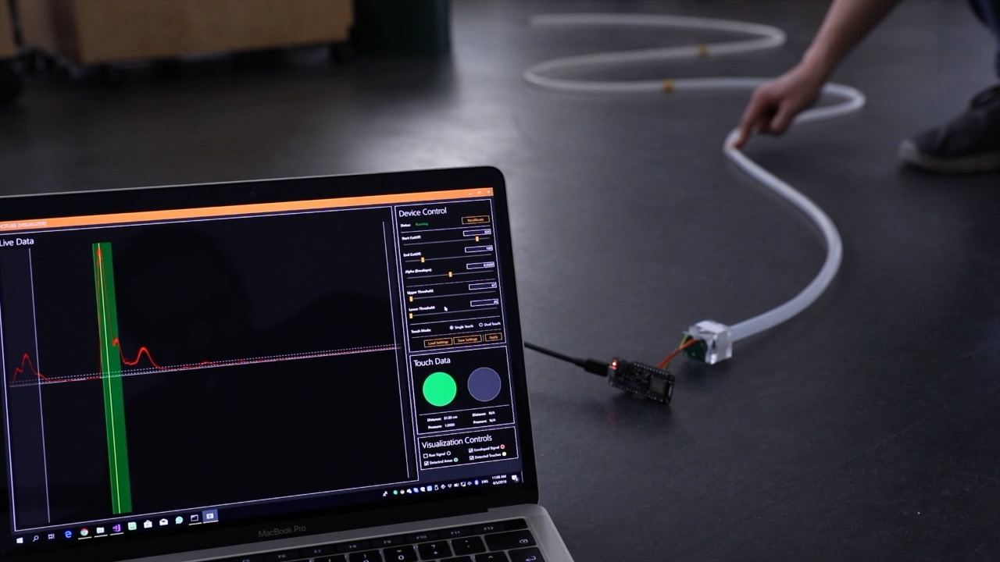
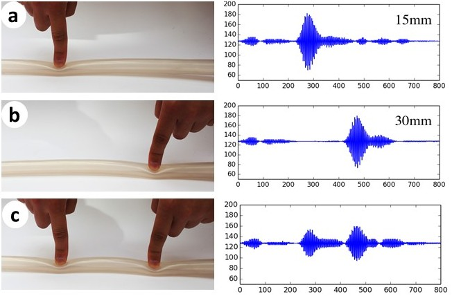

<h2>EchoTube: Modular and Robust Press Sensing along Flexible Tubes using Waveguided Ultrasound</h2>

### Abstract

While pressing can enable a wide variety of interesting applications, most press sensing techniques operate only at close distances and rely on fragile electronics. We present EchoTube, a robust, modular, simple, and inexpensive system for sensing low-resolution press events at a distance. EchoTube works by emitting ultrasonic pulses inside a flexible tube which acts as a waveguide and detecting reflections caused by deformations in the tube. EchoTube is deployable in a wide variety of situations: the flexibility of the tubes allows them to be wrapped around and affixed to irregular objects. Because the electronic elements are located at one end of the tube, EchoTube is robust, able to withstand crushing, impacts, water, and other adverse conditions. In this paper, we detail the design, implementation, and theory behind EchoTube; characterize its performance under different configurations; and present a variety of exemplar applications that illustrate its potential.

### Working Principle

EchoTube is based on the principle of *acoustic time-domain reflectrometry*: a transducer emits an ultrasonic pulse, which travels through the air and reflects on the objects that it encounters. These reflections travel back towards the transducer. By measuring the amount of time **Δt** between emitting the pulse and receiving its reflection, the distance **d** of the reflecting object can be calculated according to **2d = c\Δt**, where **c** is the speed of sound in the medium.

We use consumer-level ultrasonic ranging modules in EchoTube. These are used in robotics and other unconstrained sensing applications, and are often used for sensing in open air. We make two key modifications. First, we enclose the transducer in one end of a flexible rubber tube, effectively constraining the sensing volume of the module. This prevents the ultrasonic pulse from being reflected by objects in the environment and guides it along the tube. In this tube-based configuration, the ultrasonic pulse propagates until it is reflected by discontinuities in the tube such as a hole, or, in our application, a deformation formed by an external object.

Second, instead of interfacing with the ultrasonic ranging modules' digital output, which gives only the calculated range to the first reflection, we directly analyze the raw output from the sensor itself, allowing calculation not only of the distance to the first reflecting object, but further objects as well.

### Repository Overview

In this repository you will find the essential information to get started with EchoTube. You can find the academic paper [here](https://www.carlosetejada.com/s/EchoTube.pdf) for more details, experimental [source code](src) for applications, and various [multimedia assets](assets/media).
